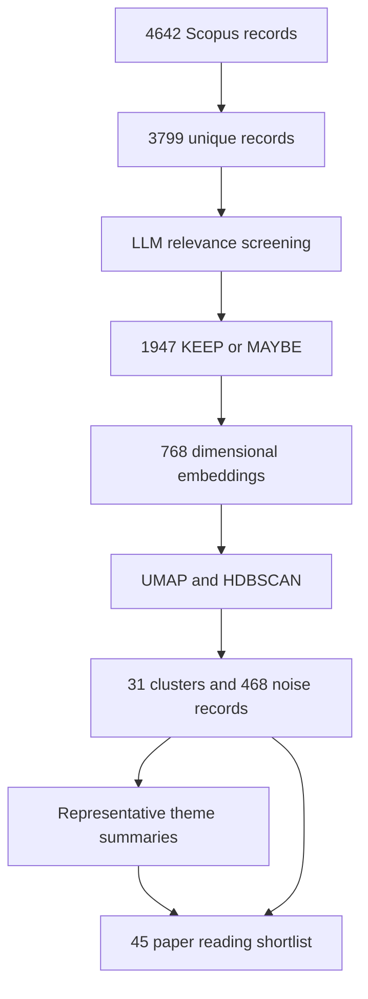

# LLM-Assisted Literature Mapping for Image Deblurring

An M.Tech research workflow by Guruvignesh R M for screening and mapping literature on motion-aware deblurring and visual perception. The original run took more than three days according to the researcher; exact elapsed runtime and API cost were not independently logged here.

## Recorded outcomes

| Stage | Count |
|---|---:|
| Six Scopus exports | 4,642 records |
| Deduplicated master | 3,799 records |
| KEEP / MAYBE / REJECT | 1,054 / 893 / 1,852 |
| Retained for semantic analysis | 1,947 |
| Papers assigned to 31 clusters | 1,479 |
| HDBSCAN noise records | 468 |
| Metadata representatives for theme summaries | 465 (15 per cluster) |
| Original reading shortlist | 45 |

The raw API-pass workbook records 3,796 successful responses: 1,052 KEEP, 892 MAYBE and 1,852 REJECT. Three parse failures were resolved in the downstream input as two KEEP and one MAYBE (`results/recorded_resolutions.csv`). These are recorded downstream decisions, not newly verified relevance judgments. The table above includes those recorded resolutions.

The later audit found 45 local PDFs with two substitutions relative to the original shortlist. An English core would comprise 44 candidates plus one Chinese-language paper retained for novelty checking. This was not an English-only exclusion stage in the original pipeline.



## Method

Screening uses titles, abstracts, keywords and query provenance. Scores 7–10 map to KEEP, 5–6 to MAYBE, and 0–4 to REJECT. The historical scripts identify `gemma-4-26b-a4b-it` for screening and thematic summaries and `gemini-embedding-2` for embeddings; these strings document the saved configuration, not a guarantee of current API availability.

The clustering script generates 768 dimensional embeddings, applies L2 normalization, then UMAP (10 dimensions, cosine distance, 15 neighbors, minimum distance 0.05, seed 42) and HDBSCAN (minimum cluster size 15, minimum samples 5). A separate 2D UMAP supports plotting. Themes are summarized from 15 representatives per cluster, selected using membership probability and relevance.

The final literature spans motion/IMU/gyro assistance, downstream perception, robotics applications, and image-only baselines. The selection of the final shortlist involved researcher judgment; it is not an automatic top-45 output of the API stages.

## Workflow scripts

- `scripts/prepare_clustering_input.py`: new handoff helper for retained records and explicit resolutions.
- `scripts/gemma4_26b_RESUME_V2_UNICODE_FIX.py`: full screening and resume, checkpoint after each attempted paper, timeout-protected child requests and Unicode transport fixes.
- `scripts/gemini_embedding_cluster_1947.py`: embedding checkpoints, UMAP and HDBSCAN, clustered workbook output.
- `scripts/theme_summary_FINAL_V2_SAFE.py`: representative selection, JSON extraction, three attempts and a 180-second timeout per attempt, saving after each successful cluster.

These files preserve the workflow with publication fixes for checkpoint input identity, schema validation, invalid embedding rejection, integer scores and atomic theme saves. See `CHANGELOG.md`. `provenance.json` records original and release script SHA256 hashes. Offline validation is recorded in `VALIDATION.md`; the historical API pipeline was not rerun.

## Running with your own authorized inputs

Install the packages in `requirements.txt` in a virtual environment. Historical package versions were not captured, so this is a dependency list rather than a locked reproduction environment.

Create a `run` directory and set `GEMINI_API_KEY` in the environment. Run the scripts from that directory; the filenames and workbook schemas are specified in each script.

1. Supply `Deblurring_Literature_Master_Deduplicated.xlsx` and run the screening script.
2. Run `scripts/prepare_clustering_input.py` against the screening output. It selects successful KEEP/MAYBE decisions and constructs embedding text from title, abstract and keyword fields. Optionally supply a reviewed resolution ledger using `--resolutions`. The included historical ledger is bound to the original screening workbook hash and must not be applied to a different corpus. This new preparation helper does not claim to reproduce the exact historical embedding-text formatting. Original merge/deduplication is not implemented by these scripts.
3. Run the embedding/clustering script.
4. Run the theme-summary script against the generated clustered workbook.
5. Verify generated judgments against source papers and document the final selection decisions.

Example PowerShell commands, from the repository root:

```powershell
python -m venv .venv
.\.venv\Scripts\python.exe -m pip install -r requirements.txt
New-Item -ItemType Directory -Force run
Set-Location run
# Set GEMINI_API_KEY securely in this process before executing.
..\.venv\Scripts\python.exe ..\scripts\gemma4_26b_RESUME_V2_UNICODE_FIX.py
..\.venv\Scripts\python.exe ..\scripts\prepare_clustering_input.py
..\.venv\Scripts\python.exe ..\scripts\gemini_embedding_cluster_1947.py
..\.venv\Scripts\python.exe ..\scripts\theme_summary_FINAL_V2_SAFE.py
```

Do not reuse historical checkpoints with reordered or changed inputs. The release binds each stage to the exact input-file and script SHA256. Unverified historical checkpoints are rejected rather than silently reused. Archive existing outputs before beginning a new corpus. Capture package versions for each new run. Model/API responses can vary even with unchanged inputs.

## Interpretation and limitations

This is an AI-assisted literature mapping and selection workflow. Recorded counts establish internal pipeline outcomes, not screening accuracy or exhaustive coverage. LLM-generated gap statements are hypotheses requiring full-text verification. HDBSCAN noise is not equivalent to irrelevant literature. The initial deduplication has not been independently replayed, and rejects have not undergone an independent random audit.

A later targeted metadata audit derived 1,883 candidate records by removing 64 proceedings/book/duplicate/retracted records. Clustering was not rerun: the 31 clusters and 468 noise records still describe the original 1,947-record corpus.

Full paper PDFs, bulk Scopus exports, private conversation transcripts and API credentials are not bundled. Public inputs should be added only with appropriate redistribution rights. This release provides scripts, verified aggregate results, the original 45-paper bibliographic shortlist and a cluster theme index. It does not contain the complete historical input dataset.


## Verification

Run `python -m unittest discover -s tests -v` from the repository root. `VALIDATION.md` records the offline checks and their limits. `results/historical_run_summary.json` includes SHA256 hashes of the local source workbooks, embeddings and exports. The bibliographic shortlist preserves the original selection; it does not incorporate later PDF substitutions. Cluster labels and names describe this corpus and are not a general taxonomy.
